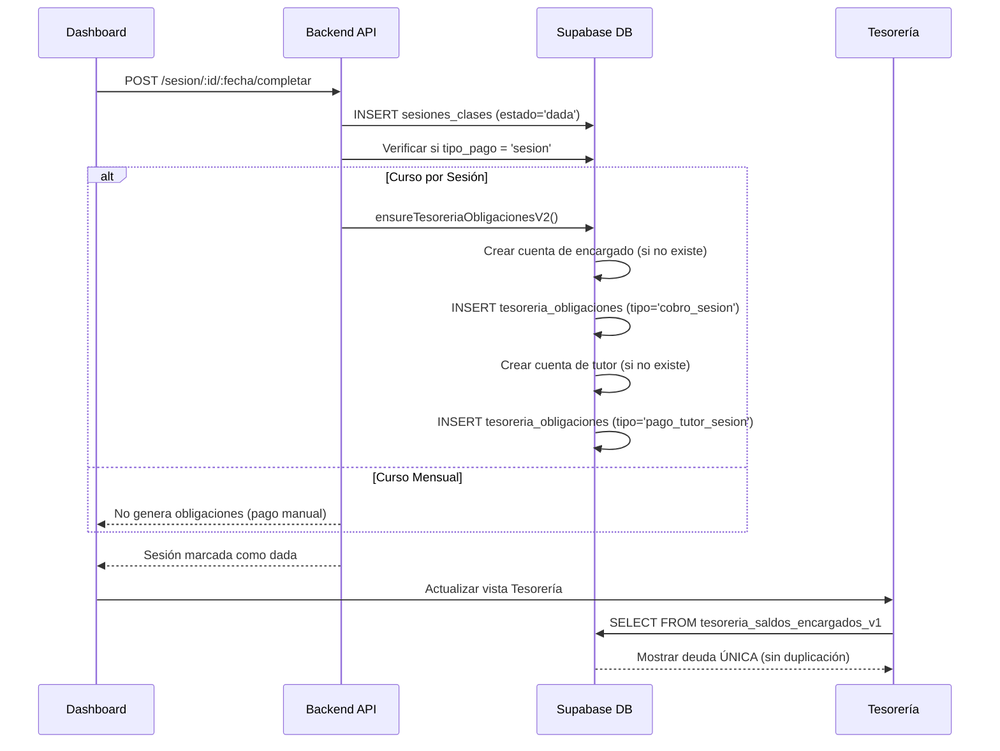
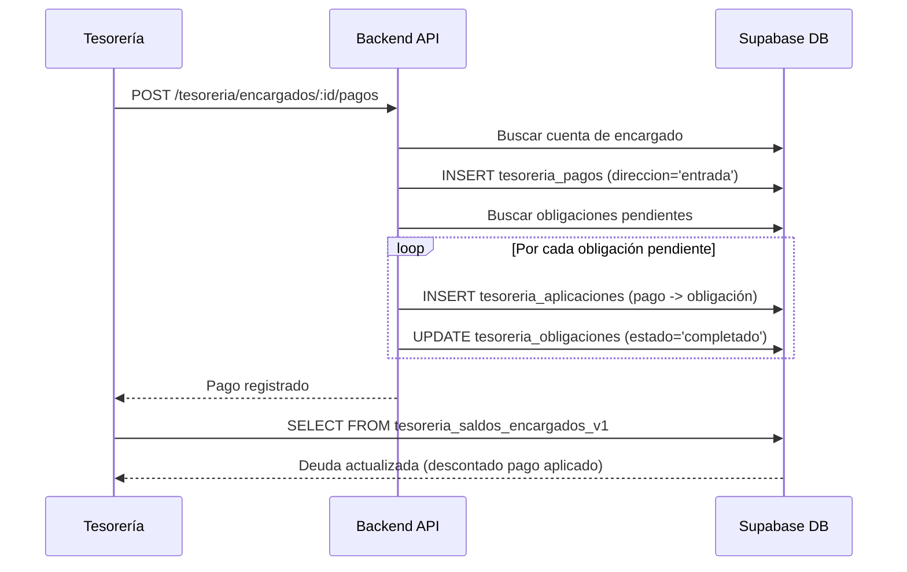

# 📊 Análisis de Impacto: Eliminación del Sistema Antiguo de Pagos

**Fecha:** 17 de febrero de 2026  
**Cambios implementados:** Eliminación de duplicación entre `movimientos_dinero` y `tesoreria_obligaciones`

---

## 🎯 Resumen Ejecutivo

Se eliminó la **generación automática de movimientos_dinero** cuando se marca una sesión como dada, para usar **exclusivamente el sistema de Tesorería v2 (obligaciones)** y evitar duplicación de deudas.

### ✅ Problema Resuelto
- **Antes:** Al marcar sesión como dada se creaban AMBOS:
  - ✓ Obligación en `tesoreria_obligaciones` (₡7,500)
  - ✓ Movimiento en `movimientos_dinero` (₡7,500)
  - **Total mostrado:** ₡15,000 (duplicado)

- **Ahora:** Solo se crea:
  - ✓ Obligación en `tesoreria_obligaciones` (₡7,500)
  - **Total mostrado:** ₡7,500 (correcto)

---

## 📋 Cambios Implementados

### 1. Backend - Routes/Dashboard.js

#### ❌ Eliminado (líneas ~1250-1285)
```javascript
// YA NO SE GENERA - Sistema antiguo
const ingreso = {
  tipo: 'ingreso_estudiante',
  monto: parseFloat(m.cursos?.costo_curso || 0),
  ...
};
const pagoPendiente = {
  tipo: 'pago_tutor_pendiente',
  monto: parseFloat(m.cursos?.pago_tutor || 0),
  ...
};
await supabase.from('movimientos_dinero').insert([ingreso, pagoPendiente]);
```

#### ✅ Nuevo comportamiento
```javascript
// Solo genera obligaciones de tesorería v2
const tipoPago = String(m.cursos?.tipo_pago || 'sesion');
if (tipoPago !== 'mensual') {
  await ensureTesoreriaObligacionesV2(sesion.id);
}
```

### 2. Vista SQL - tesoreria_saldos_encargados_v1

#### ❌ Eliminado
```sql
-- CTE que sumaba movimientos_dinero
mov_deudas AS (
  SELECT encargado_id,
    SUM(CASE WHEN md.estado = 'pendiente' AND md.tipo = 'ingreso_estudiante' 
        THEN md.monto ELSE 0 END) AS movimiento_pendiente
  FROM movimientos_dinero md
  ...
)

-- Suma DUPLICADA en SELECT final
COALESCE(ob.obligado_pendiente, 0) + COALESCE(mov_deudas.movimiento_pendiente, 0)
```

#### ✅ Nuevo cálculo
```sql
-- Solo suma obligaciones
SELECT
  cc.encargado_id,
  COALESCE(ob.obligado_pendiente, 0) AS deuda_pendiente,  -- Sin suma de movimientos
  ...
```

---

## 🔄 Flujo Completo del Sistema (Actual)

### Flujo: Marcar Sesión como Dada



### Flujo: Registrar Pago de Encargado



---

## 🚨 Casos Especiales que AÚN Usan movimientos_dinero

### 1. Cobros Grupales (Estudiantes Bulk sin Encargado)

**Ubicación:** `backend/routes/tesoreria.js` - Line 1017  
**Endpoint:** `POST /tesoreria/grupos/:grupoId/cobro`

**Por qué se mantiene:**
- Estudiantes en `estudiantes_bulk` NO tienen `encargado_id`
- No se pueden crear cuentas de tesorería sin encargado
- Se usa `movimientos_dinero` como sistema alternativo

**Flujo:**
```javascript
// Para cada estudiante en el grupo:
await supabase.from('movimientos_dinero').insert({
  tipo: 'ingreso',
  origen: 'cobro_grupal',  // Identificador especial
  estado: 'pendiente',
  ...
});
```

**Impacto en resumen:**
```javascript
// backend/routes/tesoreria.js - Line 576
router.get('/resumen', async (_req, res) => {
  // Suma deudas de encargados (sistema v2)
  const deudaPendiente = encRows.reduce(...);
  
  // TAMBIÉN suma cobros grupales (sistema antiguo)
  const deudaCobroGrupal = cobroGrupalRows.reduce(...);
  
  return res.json({ 
    deudaPendiente: deudaPendiente + deudaCobroGrupal,  // Suma ambas fuentes
    ...
  });
});
```

### 2. Cursos Mensuales (Cierre Manual)

**Ubicación:** Flujo manual de tesorería  
**Contexto:** Cursos con `tipo_pago = 'mensual'`

**Comportamiento:**
- Al marcar sesión dada: **NO genera obligaciones automáticas**
- Contador debe generar cobro mensual manual
- Puede usar movimientos_dinero o crear obligación manual

---

## 📊 Estado Actual del Sistema

### ✅ Sistema Nuevo (Tesorería v2) - ACTIVO

**Tablas:**
- `tesoreria_cuentas_corrientes` - Cuenta por encargado/tutor
- `tesoreria_obligaciones` - Deudas esperadas (cobros/pagos)
- `tesoreria_pagos` - Pagos reales registrados
- `tesoreria_aplicaciones` - Vincula pagos con obligaciones

**Vistas:**
- `tesoreria_libro_diario_v1` - Historial de pagos
- `tesoreria_saldos_encargados_v1` - Saldos por encargado (ACTUALIZADA)
- `tesoreria_saldos_tutores_v1` - Saldos por tutor

**Endpoints Activos:**
- `/tesoreria/encargados/resumen` - Lista de encargados con deudas
- `/tesoreria/tutores/resumen` - Lista de tutores con pagos pendientes
- `/tesoreria/diario` - Libro diario
- `/tesoreria/cuentas/encargado/:id/movimientos` - Libro auxiliar
- `/tesoreria/encargados/:id/pagos` - Registrar pago
- `/tesoreria/tutores/:id/pagos` - Registrar pago a tutor

**Frontend Activo:**
- `LInguistika-Studio/views/Tesoreria.tsx` - Vista principal
- Ruta: `/pagos` → `<Tesoreria />`

### ⚠️ Sistema Antiguo - PARCIALMENTE ACTIVO

**Tabla:**
- `movimientos_dinero` - Solo para:
  - Cobros grupales (`origen = 'cobro_grupal'`)
  - Datos históricos (previo a tesorería v2)

**Endpoints DEPRECADOS** (ya no se usan):
- `/pagos/*` - Todo el módulo antiguo

**Frontend DEPRECADO:**
- `LInguistika-Studio/views/Pagos.tsx` - **NO SE USA** (ruta apunta a Tesoreria.tsx)

---

## ⚙️ Acciones Requeridas

### 🔴 CRÍTICO - Ejecutar Script SQL

**Archivo:** `backend/UPDATE_TESORERIA_V2_SOLO_OBLIGACIONES.sql`

**Pasos:**
1. Ir a https://app.supabase.com
2. SQL Editor → Nueva query
3. Pegar contenido del archivo
4. **Ejecutar** (Run)

**Verificación:**
```sql
-- Debe mostrar deudas SIN duplicación
SELECT 
  e.nombre AS encargado,
  s.deuda_pendiente,
  s.saldo_a_favor
FROM tesoreria_saldos_encargados_v1 s
JOIN encargados e ON e.id = s.encargado_id
WHERE s.deuda_pendiente > 0
ORDER BY s.deuda_pendiente DESC
LIMIT 5;
```

### 🟡 RECOMENDADO - Limpieza de Código

#### Eliminar archivos deprecados:
```bash
# Frontend
rm LInguistika-Studio/views/Pagos.tsx

# Backend - considerar deprecar
# backend/routes/pagos.js  (mantener solo para migración histórica)
```

#### Actualizar imports:
- Remover referencias a `api.pagos.*` en código frontend

### 🟢 OPCIONAL - Migración Histórica

**Si necesitas migrar datos antiguos de movimientos_dinero:**

```sql
-- Ejemplo: Convertir movimientos históricos a obligaciones
-- (Solo si tienes datos previos importantes en movimientos_dinero)
INSERT INTO tesoreria_obligaciones (
  tipo, cuenta_id, monto, fecha_devengo, estado, detalle, ...
)
SELECT 
  CASE md.tipo
    WHEN 'ingreso_estudiante' THEN 'cobro_sesion'
    WHEN 'pago_tutor_pendiente' THEN 'pago_tutor_sesion'
  END,
  ...
FROM movimientos_dinero md
WHERE md.created_at < '2026-01-01'  -- Fecha de corte
  AND md.estado = 'pendiente'
  AND md.origen IS NULL;  -- Excluir cobros grupales
```

---

## 🧪 Testing Recomendado

### Test 1: Marcar Sesión como Dada (Sesión)
1. Tener curso con `tipo_pago = 'sesion'`, costo ₡7,500
2. Marcar sesión como dada desde Dashboard
3. **Verificar:** Tesorería muestra deuda de ₡7,500 (NO ₡15,000)
4. **Verificar:** En DB existe obligación en `tesoreria_obligaciones`

### Test 2: Registrar Pago
1. Ir a Tesorería → Encargados
2. Seleccionar encargado con deuda
3. Registrar pago de ₡7,500
4. **Verificar:** Deuda baja a ₡0
5. **Verificar:** En DB: `tesoreria_pagos` + `tesoreria_aplicaciones`

### Test 3: Libro Auxiliar
1. Abrir libro auxiliar de encargado
2. **Verificar:** Muestra:
   - Obligación: ₡7,500 debe
   - Pago: ₡7,500 haber
   - Saldo: ₡0

### Test 4: Cobro Grupal (Sistema Antiguo)
1. Crear grupo con estudiantes bulk
2. Registrar cobro grupal
3. **Verificar:** Crea movimientos en `movimientos_dinero`
4. **Verificar:** Aparece en resumen general

---

## 📈 Beneficios de los Cambios

### ✅ Eliminación de Duplicación
- **Antes:** Deudas aparecían duplicadas
- **Ahora:** Monto correcto en todos los reportes

### ✅ Consistencia de Datos
- Un solo sistema de verdad (tesorería v2)
- Menos posibilidad de inconsistencias

### ✅ Idempotencia Mejorada
- Volver a marcar sesión dada NO duplica
- Constraint único en `tesoreria_obligaciones` por sesión

### ✅ Auditoría Clara
- `tesoreria_aplicaciones` vincula pagos con obligaciones
- Trazabilidad completa de cada pago

---

## 🔮 Próximos Pasos (Opcional)

### Fase 1: Estabilización (Actual)
- ✅ Eliminar duplicación
- ✅ Actualizar vista SQL
- ⏳ Ejecutar script en Supabase
- ⏳ Testing completo

### Fase 2: Limpieza
- Eliminar archivo `Pagos.tsx`
- Marcar endpoints de `/pagos` como deprecados
- Documentar solo cobros grupales usan `movimientos_dinero`

### Fase 3: Migración Completa (Futuro)
- Convertir cobros grupales a sistema v2
- Crear "encargados virtuales" para grupos
- Deprecar `movimientos_dinero` completamente

---

## 💡 Preguntas Frecuentes

### ¿Qué pasa con los movimientos_dinero existentes?
- **Se mantienen** en la base de datos
- **NO se eliminan** (datos históricos)
- **Solo para cobros grupales** se siguen creando

### ¿Puedo seguir usando la vista antigua de Pagos?
- **No**, la ruta `/pagos` ya apunta a `Tesoreria.tsx`
- El archivo `Pagos.tsx` está huérfano (no se usa)

### ¿Cómo afecta a los reportes?
- **Mejora:** Montos correctos (sin duplicación)
- **Tesorería v2:** Todos los reportes principales
- **Sistema antiguo:** Solo cobros grupales en resumen

### ¿Necesito hacer algo manual?
- **Sí:** Ejecutar script SQL en Supabase (CRÍTICO)
- **No:** Backend ya actualizado
- **No:** Frontend ya usa sistema nuevo

---

## 📞 Soporte

Si encuentras problemas después de los cambios:

1. **Verificar:** Script SQL ejecutado correctamente
2. **Revisar:** Consola del navegador (errores)
3. **Consultar:** Logs del backend
4. **Rollback:** Restaurar vista SQL a versión anterior si hay problemas críticos

```sql
-- Rollback: Volver a incluir movimientos_dinero (NO RECOMENDADO)
-- Solo usar si hay problemas críticos
CREATE OR REPLACE VIEW tesoreria_saldos_encargados_v1 AS
...
COALESCE(ob.obligado_pendiente, 0) + COALESCE(mov_deudas.movimiento_pendiente, 0)
...
```

---

**Documento generado automáticamente**  
**Autor:** GitHub Copilot  
**Última actualización:** 17 de febrero de 2026
